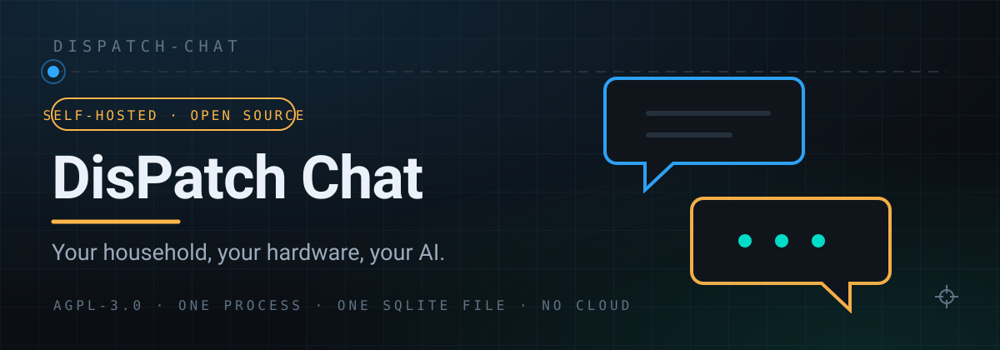
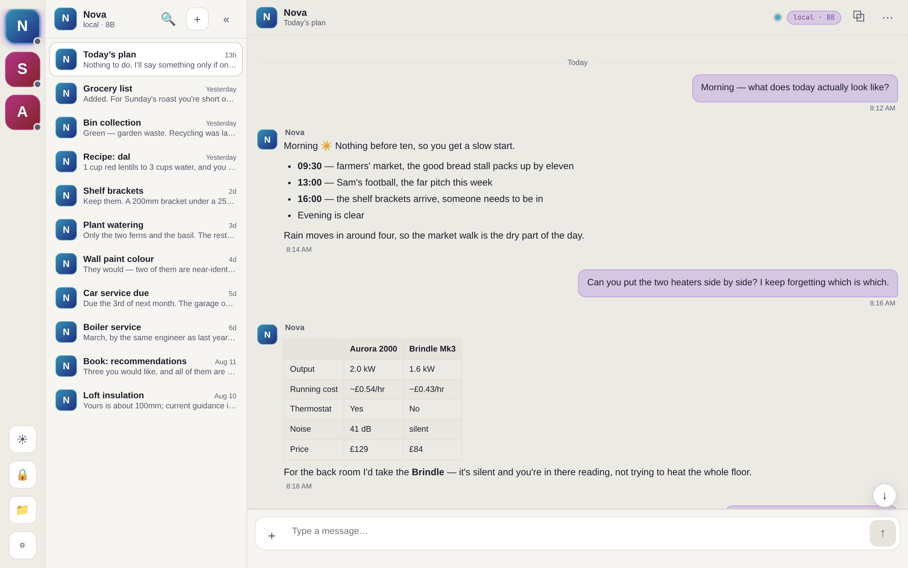
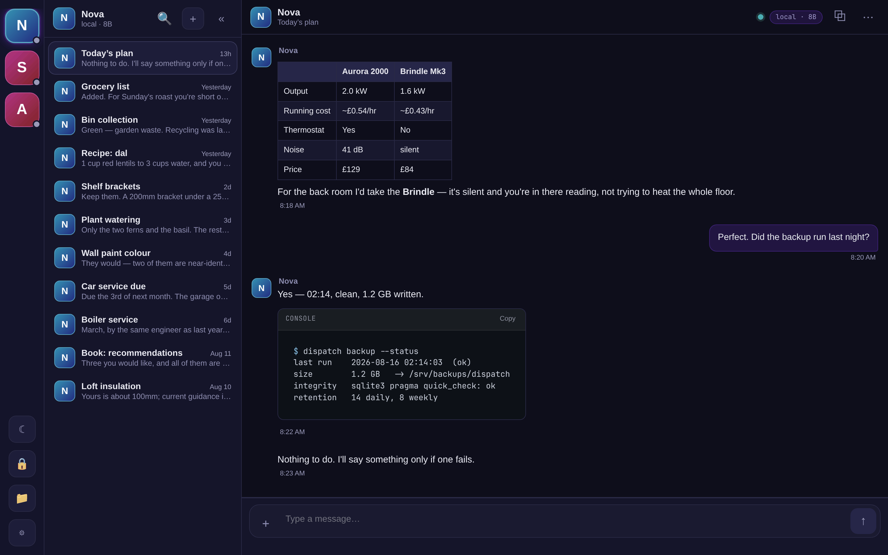
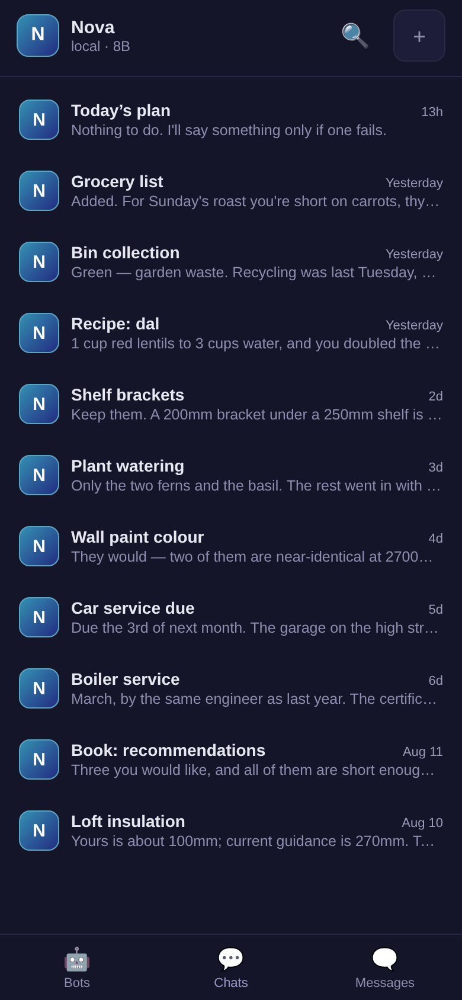
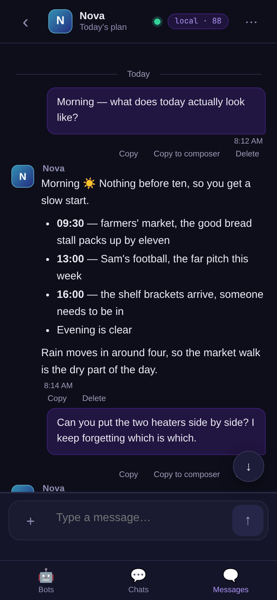
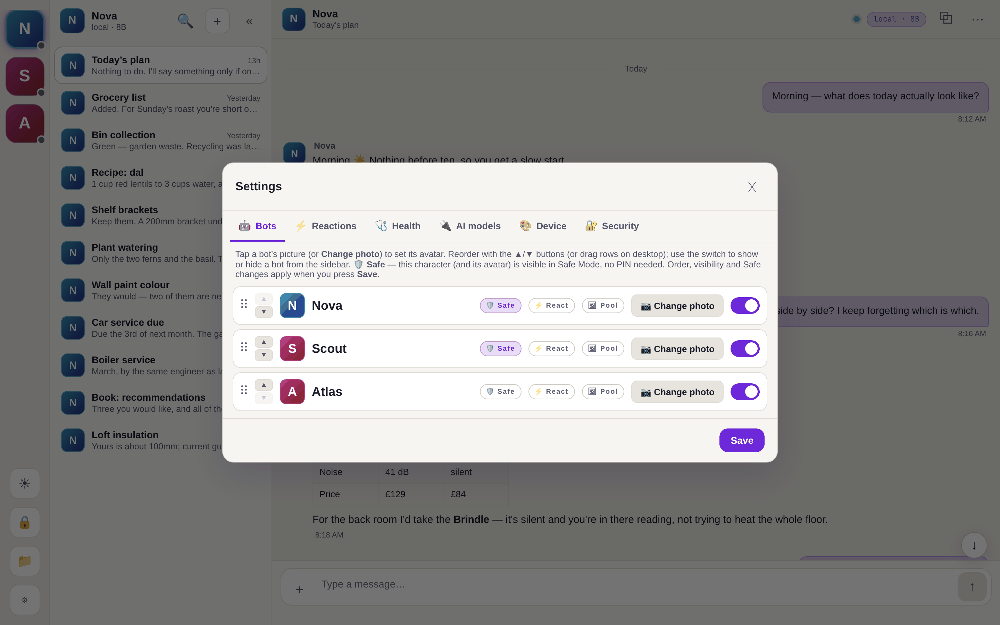
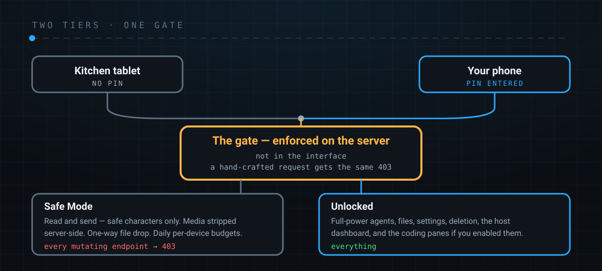

<div align="center">



**A self-hosted chat app for you, your household, and your AI agents.**

Runs on your hardware. Your conversations stay in a SQLite file you can read,
back up, and delete. No account, no cloud, no telemetry.

[Quick start](#quick-start) · [Bring your own AI](#bring-your-own-ai) ·
[Deployment](#deployment) · [Security](#security) ·
[Documentation](docs/) · [Changelog](CHANGELOG.md) ·
[Contributing](CONTRIBUTING.md)

</div>

---

## What it is

DisPatch Chat is a small, fast application you host yourself. It looks and feels
like a normal messaging app — threads, avatars, markdown, file sharing, search,
a phone-installable PWA — and it can talk to AI agents running on your own
machine as well as to the other people in your household.

It is deliberately **one process and one SQLite file**. No Redis, no Postgres,
no message broker, no build step. It runs comfortably on a Raspberry Pi.

**Not** a Slack replacement. **Not** end-to-end encrypted (see
[Security](#security) for exactly what that means). It is a private chat you own.

### The shape of it, honestly

A whole household can use one install, and everyone who unlocks it sees the same
threads, so people really can talk to each other in here. That works, and some
families use it that way.

But it was built first as a **front door to an AI backend** — originally an
agent runtime like [OpenClaw](docs/agents.md) running on your own machine — that
happens to look and feel like the messaging app everyone already knows. The
bots are participants in the threads, not a feature bolted onto a chat app.
If what you want is a private person-to-person messenger, there are better
tools; if what you want is for your family to be able to talk to the thing
running on the box in the cupboard, this is the one.

You no longer need an agent stack for that: **Connect an AI** (below) points a
bot at a model provider's API directly. The agent path is still what you want
if you need a thing that can *use tools and act on the machine*, and it is
still the one that has to run on the same host.

It is also **single-account today**. One PIN, one shared view of everything.
Per-person accounts with separate identities, roles and per-conversation access
are designed in detail and not built — the design is in
[docs/design/multi-user.md](docs/design/multi-user.md), including the migration
that keeps an existing install's history.

## Screenshots

A demo install with three assistants configured — the same app on a desktop and
on a phone, in both themes.

<table>
  <tr>
    <td width="50%">
      
    </td>
    <td width="50%">
      
    </td>
  </tr>
  <tr>
    <td align="center"><em>Desktop, light theme — threads and markdown</em></td>
    <td align="center"><em>Desktop, dark theme — code blocks and tables</em></td>
  </tr>
</table>

<table>
  <tr>
    <td width="33%">
      
    </td>
    <td width="33%">
      
    </td>
    <td width="33%">
      
    </td>
  </tr>
  <tr>
    <td align="center"><em>Phone — thread list</em></td>
    <td align="center"><em>Phone — conversation</em></td>
    <td align="center"><em>Settings — the bot roster</em></td>
  </tr>
</table>

## Features

**Chat**
- Threads per conversation, with pinning, archiving, rename and full-text search
- Markdown with syntax-highlighted code blocks, copy buttons, and collapsible JSON
- Image, video and arbitrary file attachments with inline previews
- Live streaming replies with a collapsible "what the agent is doing" panel
- Offline-capable PWA — installs to a phone home screen

**Access control**
- A PIN unlocks full access; sessions idle-expire, and a device can be trusted
  for a sliding window if you choose
- A **limited tier** that can read and send without the PIN — for a family
  tablet on the kitchen counter — restricted to the conversations you allow,
  with all media stripped server-side and daily per-device budgets
- **One-way file drop**: a locked device can send you a file without being able
  to browse or retrieve anything

**Operations**
- Built-in **host dashboard**: health, storage, database integrity, backup
  status, and a checklist that tells you what is misconfigured and how to fix it
- Automatic rotating database backups with integrity verification
- Crash recovery that reconciles interrupted conversations rather than losing them

**Interface**
- Eight languages — English, العربية, Deutsch, Español, Français, 日本語,
  Português, 中文 — including full right-to-left layout
- Light and dark themes, respects system preference
- Keyboard-navigable, screen-reader labelled, WCAG AA contrast

**AI (optional)**
- **Bring your own model provider**: point a bot at OpenAI, Anthropic, LM
  Studio, Ollama or anything OpenAI-compatible, from a panel in the app. No
  agent runtime, no install — see below
- Or use a full **agent backend**: ships with an adapter for
  [OpenClaw](docs/agents.md), where DisPatch spawns its CLI and tails its
  session transcripts. Both of those are host-filesystem operations, so *that*
  backend has to live on the same machine — the seam that would make an agent
  runtime on another host pluggable is designed and not built
  ([docs/design/agent-backend.md](docs/design/agent-backend.md))
- Agents reply into threads like any other participant, and can push proactive
  messages (a morning briefing, a finished job, an alert)
- **Entirely optional** — DisPatch is a perfectly good human-to-human chat with
  neither configured

## Why there is a PIN

An agent backend is not a chatbot. It runs real commands on the machine it lives
on, with your credentials, because that is the entire point of having one.

Which means a child with full access could ask it, perfectly politely, to
replace your entire website with pictures of ducks. It would. It would do a
thorough job, and it would tell you cheerfully when it was finished. Nothing in
that request looks different to an agent from "summarise this email", and by the
time you read the message the ducks are live.

So the two tiers are not about keeping the family out of the chat. They are
about which half of the app is behind a door:

<div align="center">
  
</div>

**Safe Mode — no PIN.** What a kitchen tablet or a kid's phone gets. Read and
send, but only to the characters you marked safe, with media stripped
server-side, per-device daily budgets, and a one-way file drop (they can send
you a file; they cannot browse or retrieve anything). Every mutating endpoint
answers 403. The app does not even hint that it unlocks.

**Unlocked — with the PIN.** Everything: the full-power agents, files, settings,
deletion, the host dashboard, and the coding-agent panes (the server-side
terminal, and the DeepSeek Harness pane when `dsh` is installed) if you turned
them on.

The split is enforced on the server, not in the interface — a locked device that
crafts the request by hand gets the same 403 as one that presses the button.
That is the invariant to protect if you contribute: new endpoints inherit the
gate, and a permission problem is never fixed by loosening it.

## Quick start

```bash
git clone https://github.com/LaserLloyd/dispatch-chat.git
cd dispatch-chat
cp .env.example .env          # optional: every setting in it has a working default
docker compose up -d
```

If you forked, or are running your own copy, one line repoints every reference
in the tree at your own fork — image labels, the in-app source link, issue links:

```bash
grep -rl 'LaserLloyd/dispatch-chat' --exclude-dir=.git . \
  | xargs sed -i 's|LaserLloyd/dispatch-chat|myuser/dispatch-chat|g'
```

There is no secret to generate and no required setting. An empty `.env` starts a
usable server; it builds the image from the checkout — no registry account
needed — and the file is where you put a data path, a port, or an agent backend
when you want one.

Open <http://localhost:8765>, then set a PIN under **Settings → Security**.
Do it now: **the compose file publishes the port on `0.0.0.0`**, so until you
set a PIN, everyone on your network has full access. Set `BIND_ADDR=127.0.0.1`
in `.env` if you would rather it were this machine only while you look around.
(A bare `uvicorn` process with no container is the other way round — it binds
loopback unless you tell it not to.)

Not using Docker? See [docs/deploy-bare-metal.md](docs/deploy-bare-metal.md).

## Bring your own AI

DisPatch will not answer you out of the box, because it ships with no model and
talks to no cloud until you tell it to. Making it answer takes about a minute
and needs no agent stack:

1. Open **⚙ Settings → 🔌 AI models** (a fresh install also offers it as a
   card in the empty chat area).
2. Pick a provider, paste a key if it needs one, press **Test connection**, pick
   a model from the list it comes back with, press **Save & chat**.

That is it. The provider becomes a bot in your sidebar with its own threads and
history, and it works like every other conversation in the app.

Supported out of the box: **LM Studio** and **Ollama** (on your own machine, no
key, nothing leaves the box), **OpenAI**, **Anthropic**, **DeepSeek**, **Groq**,
**OpenRouter**, **Mistral**, **xAI** and **Together** — plus **Custom**, which
is anything speaking OpenAI's `/chat/completions`, so llama.cpp, vLLM, LocalAI
and most corporate gateways work too.

Two honest caveats:

- **Your key is stored in `config.yaml` in the data directory.** Every writer
  chmods that file to `0600`, so other users on the box cannot read it — but it
  is not encrypted, and anyone with your account, root, or a copy of your
  backups has it. If you would rather it were not on disk at all, name an
  environment variable instead and DisPatch reads the key from there; the
  environment always wins over the file.
- **This is a conversational assistant, not an agent.** No tools, no file
  access, nothing that can act on your machine. For that you want an
  [agent backend](docs/agents.md), which is a bigger commitment and has to run
  on the same host.

Full setup notes, per provider: [docs/llm-providers.md](docs/llm-providers.md).

## Deployment

| Platform | Guide | Notes |
|---|---|---|
| Docker / Compose | [docs/deploy-docker.md](docs/deploy-docker.md) | Recommended. amd64 + arm64 |
| Raspberry Pi | [docs/deploy-raspberry-pi.md](docs/deploy-raspberry-pi.md) | Pi 4/5. Read the SD-card section |
| Windows | [docs/deploy-windows.md](docs/deploy-windows.md) | Docker Desktop or WSL2 |
| Bare Linux | [docs/deploy-bare-metal.md](docs/deploy-bare-metal.md) | systemd unit, system or user |

### Reaching it from outside your house

DisPatch does not depend on any commercial mesh VPN. The supported ladder, in
order of what most people should pick first, is in
[docs/remote-access.md](docs/remote-access.md):

1. **Reverse proxy with a real certificate** (Caddy + Let's Encrypt DNS-01).
   TLS terminates on *your* hardware.
2. **Behind CGNAT?** A cheap VPS forwarding raw TCP to a WireGuard tunnel. Your
   traffic stays encrypted end-to-end past the VPS — it only sees ciphertext.
3. **LAN only.** Perfectly valid. The docs cover getting real certificates for a
   private network so browsers stop complaining.

The public hostname is the same in all three, which matters: passkeys are bound
to it permanently, so you can change how you reach the box without invalidating
every device.

## Security

Read [SECURITY.md](SECURITY.md) for the reporting process and
[docs/security.md](docs/security.md) for the hardening guide. The short version
of what you are trusting:

- **Your host is the trust boundary.** Anyone with shell access, or read access
  to the data directory, can read everything. The database is not encrypted at
  rest — use full-disk encryption if you need that.
- **Messages are not end-to-end encrypted**, and cannot be while a server stores
  history and hands text to agent backends. Transport is TLS; storage is your
  filesystem. Anyone claiming otherwise about an app shaped like this is
  selling something.
- **It is currently single-account, not multi-user.** One PIN grants full
  access; there are no per-person accounts yet. Everyone who unlocks sees
  everything. See the roadmap below.
- **Privacy mode** lets a device hold nothing locally: no offline cache, no
  saved settings, no persistent session. See
  [docs/security.md](docs/security.md#privacy-mode).

## Your data

Everything lives in one directory (`~/.local/share/local-chat` by default,
`/data` in the container images, `DISPATCH_DATA_DIR` to move it):

```
data/
├── chats.db                      # SQLite — messages, threads, users, sessions
├── media/                        # inline images and video
├── files/                        # file-server attachments
├── avatars/                      # avatar pools drawn by new threads
├── reactions/                    # reaction images: pack, per-bot pools, spent
├── backups/                      # rotating snapshots, integrity-checked
├── logs/
├── config.yaml                   # your bot roster and settings
├── reactions.yaml                # the named, reusable reaction pack
├── reaction-prompts-<bot>.yaml   # per-bot image prompt bank
└── .instance.lock                # single-process guard; ignore it
```

Back it up by copying the directory. Migrate hosts by moving it. Delete it and
DisPatch starts fresh. There is no hidden state anywhere else, and nothing is
transmitted off the machine unless you configure an agent backend that does so.

## Development

```bash
cd backend
uv sync                 # Python 3.12+
uv run pytest           # the test suite
uv run uvicorn app.main:app --reload --port 8765
```

The frontend has **no build step** — it is ES modules and CSS served as-is.
Edit a file, reload the page. Cache busting is two moves, not one: bump the
asset's own `?v=N` counter where it is referenced, and bump the `CACHE` constant
in `sw.js` to invalidate the shell.

Before opening a pull request:

```bash
python3 scripts/scrub_check.py      # no private data may enter the repo
python3 scripts/check-locales.py    # translations complete, consistent and safe
cd backend && uv run pytest -q
```

## Roadmap

Designed in detail and not yet built. Both designs are in the repository because
they are the next things to happen and are worth reviewing before they are:

- **[Per-person accounts](docs/design/multi-user.md)** — real users, roles, and
  per-conversation access, replacing the single shared PIN. Includes the
  migration that preserves an existing install's history.
- **[Password + TOTP, and passkeys](docs/design/remote-access-and-auth.md)** —
  proper authentication with recovery codes, plus the honest account of where
  passkeys help and where they cause self-hosting pain.

Until those land, treat DisPatch as a private chat for one household with one
shared credential. That is what it is today, and it is good at it.

## Translating

Every string lives in `frontend/static/locales/<lang>.json`. Adding a language
is one file and one line — no code. See [docs/i18n.md](docs/i18n.md).
Translation contributions are very welcome and are the easiest way to help.

## License

Copyright (c) 2026 Jake Lloyd. <!-- scrub-ok: the copyright holder is named on purpose — MIT is meaningless without an attributable notice, and this line mirrors LICENSE. -->

[MIT](LICENSE). You can run, modify, share and sell this freely — keep the
copyright notice and the licence text with it, and it comes with no warranty.

The vendored third-party libraries in `frontend/static/vendor/` keep their own
licences (MIT, BSD-3-Clause, Apache-2.0/MPL-2.0) — inventory and full licence
texts in
[frontend/static/vendor/README.md](frontend/static/vendor/README.md).
